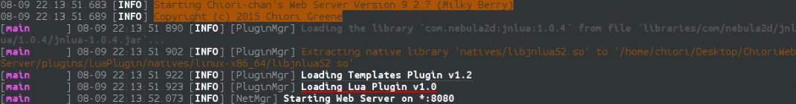

# Plugin Developer Guide

As of version 9.3 (Milky Polkadot) plugins can only be implemented using packaged java (`.jar`) archives. It is planned to implement any given scripting language, such as `groovy`, as a plugin and packaged within a `.zip` file.

See [Plugins](../README.md) on how to install them.

## Writing a Plugin - Getting Started

**Developer Note** Never use the namespace `com.chiorichan.*` within your plugins, it is exclusively reserved and will kick an error during load.

Writing a Java Plugin for **Chiori-chan's Web Server** is easy and is even easier when using an IDE with integrated Gradle support.

**Developer Note**: If you're an old school java developer and wish to not use Gradle, our server binary can also be included using the traditional libs method. While it's beyond the scope of this tutorial. Be compiling your plugin, to not include our binary nor any third-party libraries. How to add third-party libraries will be covered later in this tutorial.

First create a new Java/Gradle Project, this step will vary from IDE to IDE but in general, you will need a typical Gradle project setup; Preferably using the Gradle Wrapper and src and resources directories, i.e., `src/main/java` and `src/main/resources`. Project Name is irrelevant and Java 1.8 is recommended, while lower versions will also work.

**Developer Note**: As of February 20th 2017, **Chiori-chan's Web Server** binary is not available in any Maven Repository. We hope to change this in the near future but for the time being using [JitPack](https://jitpack.io/#ChioriGreene/ChioriWebServer "JitPack") is an excellent alternative. The following steps will be using JitPack.

### Minimal Gradle Build Script

Next you will need to create your Gradle Build Script, i.e., `build.gradle`. The following example is included for reference:

```groovy
apply plugin: 'java'

repositories
{
	jcenter()
	mavenCentral()
	maven { url 'https://jitpack.io' }
}

sourceCompatibility = '1.8'
targetCompatibility = '1.8'

group = 'com.example.plugin'
description = 'One dummy plugin to rule them all'

dependencies {
	/* Again, we're using JitPack. Reference their website for more information. */
	compile group: 'com.github.ChioriGreene', name: 'ChioriWebServer', version: 'master-dev-SNAPSHOT'
}
```

### Plugin Information

Now that you have a project that should compile using Gradle, we need to create the `plugin.yaml` file under the resources directory, i.e., `src/main/resources`. This file is used by the server is learn important details about your plugin, such as version, author, and more importantly the main class. As you might have guessed, you will be using the YAML syntax. Please be sure to not use the example values given as this will cause nothing but confusion and errors for your end users.

```yaml
name: Example Plugin # Your Plugin Name
description: "A short description about your plugin"
author: John Smith <email@example.com> # You The Author, including an e-mail in recommended.
main: com.example.plugin.MainClassFile # The class for loading your plugin.
version: '1.0' # Plugin Version Number
depends: [] # Dependencies on other plugins, e.g., Templates Plugin or Dropbox Plugin
libraries: # Covered in the next section
  - "group:name:version"
gitHubBaseUrl: https://raw.githubusercontent.com/[Username]/[Repository]/[Branch]/src/main/java/. # Normally used by our Templates Plugin to generate source previews when exceptions are encountered.
```

There are numerous other optional `plugin.yaml` keys not covered in this tutorial, we recommend you review the `PluginInformation` class javadoc for details.

```yaml
authors: # Used in the place of 'author' when there exists more than a single author.
  - Bob <bob@example.com>
  - Ken <ken@matel.com>
website: http://example.com # The website for yourself or the plugin
softdepends: [] # Like 'depends' but won't fail to load if the plugin is missing.
runlevel: INITIALIZED
natives: [] # Advanced feature, hopely a separate tutorial to come.
```

### Create Your Plugin Class

Lastly you need to create your main plugin class file under the `src/main/java` directory.

```java
package com.example.plugin;

import com.chiorichan.plugin.lang.PluginException;
import com.chiorichan.plugin.loader.Plugin;

/**
 * Main initializing class for Example Plugin
 */
public class MainClassFile extends Plugin
{
	@Override
	public void onDisable() throws PluginException
	{
		// Called when your plugin is disabled by the server.
		// It is recommended you deconstruct your plugin here.
		// Note that onEnable() will get called thereafter if the server is reloading.
	}
	
	@Override
	public void onEnable() throws PluginException
	{
		// Called when your plugin is enabled by the server.
		// It is recommended you do most of your plugin loading logic here.
	}
	
	@Override
	public void onLoad() throws PluginException
	{
		saveDefaultConfig(); // Save default config to data directory.
		// Called when your plugin is loaded by the server, never will it get called again unlike onEnable()
	}
}
```

There also exists other optional methods that you override for additional control, before overriding any of these method we recommend you review the original:

```java
...
@Override
public YamlConfiguration getConfig()
{
	/* Override to fine tune your YamlConfiguration instance. */
}

@Override
public File getConfigFile()
{
	/* Override to change the location of your default configuration file. */
}

@Override
public File getDataFolder()
{
	/* Override to change the location of your plugin data folder.
	It's not recommended to move it outside the 'plugins' directory */
}

@Override
public void reloadConfig()
{
	/* Reload your YamlConfiguration instance here */
}

@Override
public void saveConfig()
{
	/* Save your overridden YamlConfiguration instance here */
}

@Override
public void saveDefaultConfig()
{
	/* Unpackage your default Yaml Configuration from your jar */
}

@Override
public String toString()
{
	/* Return a string representation of your plugin */
}
...
```

### Loading Third-party Libraries

Before including any third-party libraries, it's highly recommended you do the following; 1) Consider if the library is truly needed and that the same functionality can not already be obtained using either Java 8 or built-in server features, e.g., `ZIO` or `ZObjects`, 2) Check if the library is not already used by the server and if so only load the same version, as newer or older versions could crash the server. As of version 10, these are the following third-party libraries used by the server, keep in mind these will change from server version to server version:

* Bouncy Castle v1.53
* Json Web Token v0.5.1
* JANSI v1.11
* JOPT Simple v4.7
* Groovy v2.4.7
* Reflections v0.9.9
* Netty v5.0.0.Alpha2
* MySQL Connector v5.1.35
* SQLite JDBC v3.8.11.2
* H2 v1.4.187
* Guava v18.0
* Apache Commons Lang v3.3.2
* Apache Commons IO v2.4
* Apache Commons Net v3.3
* Apache Commons Codec v1.9
* SnakeYAML v1.13
* Google Closure Compiler r2388
* Mozilla Rhino v1.7R4
* LessCSS Engine v1.3.0
* Joda Time v2.7
* Pretty Time v3.2.5.Final
* libphonenumber v7.0.4
* GSON v2.3
* Apache Http Components v4.3.5

Once you have done the previously mentioned, each required library will be added to your `plugin.yaml` under the key `libraries` in the form of `- "group:name:version"`, obviously this would mean the library needs to be available from JCenter or MavenCentral.

```yaml
libraries:
  - "com.baulsupp.kolja:jcurses:0.9.5.3" # Example
  - "package:name:version" # Example
```

#### How Does This Work?

**Chiori-chan's Web Server** has the unique ability to load plugin during runtime directly from their maven repository. This feature is great as it minimizes any distribution license issues and keeps your compiled plugin as slim as possible. This feature is also a precursor to the planned plugin repository we wish to launch. Each of the libraries are downloaded and cached into the `libraries` directory.

1. The server reads the list of third-party libraries defined.
2. Going in order, checks if the library is not already cached.
3. If not, it compiles a url and makes a request for the POM file, if that succeeds the jar is also downloaded and cached.
4. Lastly the library is imported into the server classpath.

### Compile Your Plugin

#### If you wish to compile from Eclipse IDE

  * Goto `File -> Export...`
  * Select `Java -> JAR file`
  * Click `Next`
  * Click the `+` to the left of your plugin project, in the top left pane
  * Check the `src/main/java` and `src/main/resources` directories found under that
  * Under JAR file, specify a jar archive name and parent path, e.g., `/home/john/Desktop/ExamplePlugin.jar`
  * Click `Finish`
  * Window closing means the build was successful without warnings
  
#### All others

Simply open your terminal or command prompt and execute `./gradlew build`, assuming you have the gradle wrapper installed. If the command ends with "Build Successfully", you should find your compiled jar under the directory `build/dist/[name].jar`.

#### Loading Plugin

Once you have a `jar` binary in hand, copy it to your server's plugins directory. Load the server and enjoy your new plugin.


